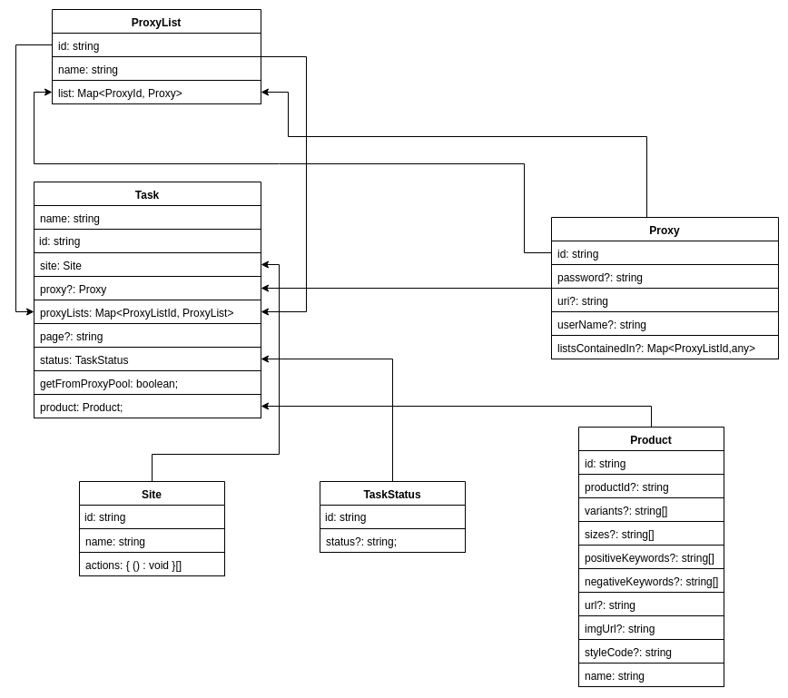

## License

This project is privately licensed - see the [LICENSE.md](LICENSE.md) file for details
## Local Development

### `npm start` or `yarn start`

Runs the project in development/watch mode.

### `npm run build` or `yarn build`

Bundles the package to the `dist` folder.

### `npm test` or `yarn test`

Runs the test watcher (Jest) in an interactive mode.

### ERD

